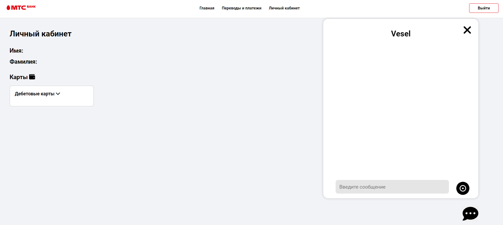

# Frontend голосового ассистента Veles
Голосовй ассистент Veles предназначен, для возможности исполнения банковских операций

Вся разметка обозначена aria-атрибутами для возможности чтения screen-reader, что улучшает доступность для различных категорий пользователей

## Основная информация в src
Components:
- `img` - логотип МТС банка
- `Pages` - Собранная страница приложения (Личный кабинет с голосовым ассистентом)
- `Styles` - Стили (заголовка, голосового ассистента, личного кабинета)
- `Voice` - Голосовой ассистент
`.env` - URL всех API адресов

## Основной файл функциональности голосового чата в VoiceChat.js
Функции, которые используются:
- Открытие/закрытие модального окна - запрос на сервер по websocket/установка сессии;
- Ввод пользователя в input - отправка на сервер - отображение в чате;
- Запись голоса - отправка на сервер - отображение в чате.
- Ответы голосового ассистента (команды, просто сообщения, результат выполнения команды) отображаются исходя из ответов из запросов

## Внешний вид и функциональность приложения
Приложение с маршрутизацией в файле App.js
- `/` Регистрация
- `/login` Войти 
- `/dashboard` Главная, только для авторизованных пользователей (с голосовым ассистентом)

Это полнофункциональное приложение. Пользователи могут зарегистрироваться и войти в систему, после получить доступ к главной странице приложения и воспользоваться голосовым ассистентом.

## Главный файл сборки frontend оболочки происходит в App.js
- Отображение главной страницы, аутентификациии, регистрации;
- Безопасная маршрутизация по страницам. 
- Главный файл App.js рендерится в index.js

## Запустить проект можно с помощью 

### `npm start`
